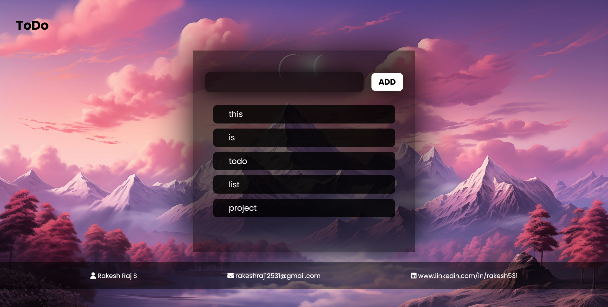

# ✅ ToDo Web App 📋🔥

Say hello to your productivity buddy – the **ToDo Web App** built by the one and only **Rakesh Raj S.** 💪  
This sleek lil’ app is your go-to task tracker made using just **HTML**, **CSS**, and **JavaScript** – no frameworks, no fluff, just pure frontend magic ⚡

---

## 🌄 Sneak Peek – Project Preview 🖼️

> Simple, clean, and straight to the point – like that one friend who actually finishes their to-do list 🤯

---

## 🎥 Full Walkthrough – YouTube Demo 🎬💥

▶️ **Watch the Full Video Demo Here:**  
🔗 [https://youtu.be/XnvYGlG8iaE](https://youtu.be/XnvYGlG8iaE)

> Sit back, watch, and realize how badly *you* need this app in your life 🤡📝

---

## 🌐 Live Demo – Try It Out Now 🚀

Wanna vibe with the app in real-time?  
👉 [https://rakesh12531.github.io/todo_web_project/](https://rakesh12531.github.io/todo_web_project/)  

🧠 Add tasks, remove ‘em, get productive like a true boss 😎

---

## ✨ Features That Slap Hard 💣

📝 **Add tasks instantly** – one click and it’s listed  
🗑️ **Delete tasks** – because not every goal needs to be achieved 😆  
🎨 **Minimal UI** – clean, clutter-free experience  
⚡ **Fast and lightweight** – no loading screens, no patience needed  
💻 **Local JS only** – zero backend, infinite frontend power 💥

---

## 🧰 Tech Stack – Pure Frontend Vibes 💅

🔹 **HTML** – Content skeleton  
🔹 **CSS** – Layout and styling  
🔹 **JavaScript** – Brain behind the behavior  
🔹 **GitHub Pages** – Hosted like a pro  

---

## 👨‍💻 Author – The Legend Behind It

Made with caffeine and chaos by **Rakesh Raj S.**  
Web dev, IoT hustler, and your fav neighborhood coder 🧠💡

- 📧 Email: [rakeshraj12531@gmail.com](mailto:rakeshraj12531@gmail.com)  
- 🔗 LinkedIn: [linkedin.com/in/rakesh531](https://www.linkedin.com/in/rakesh531)  
- 🐙 GitHub: [github.com/rakeshraj531](https://github.com/rakeshraj531)  

---

## 🚀 What You'll Learn from This Project

💡 How to handle DOM like a wizard  
📥 Managing user inputs dynamically  
🗂️ Task list updates with JavaScript  
🧠 Local logic – no need for backend headaches

---

## 🙌 Feel Free to Fork This Baddie

Clone it, remix it, go wild!  
But hey… don't forget to ⭐ this repo and drop a comment on the YouTube demo 👇  
You might just make this dev’s day 😭❤️

---

